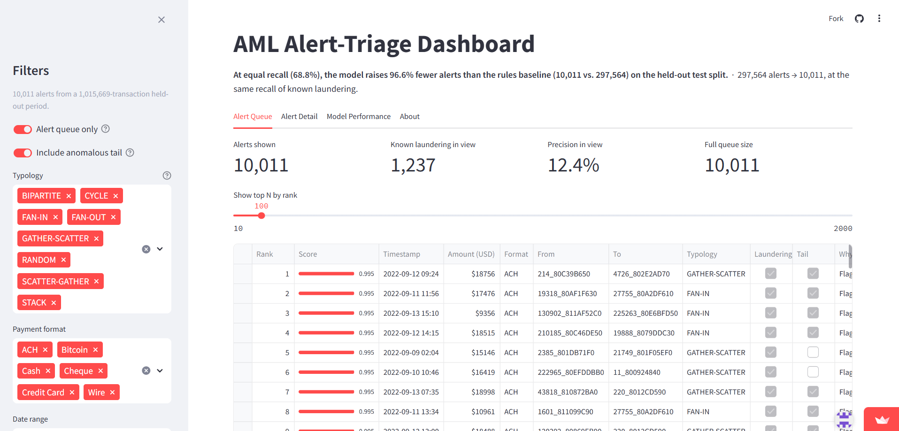
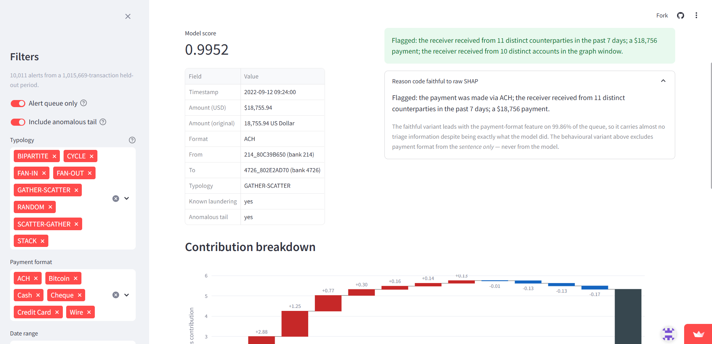

# AML Transaction Alert-Triage System

[](https://github.com/Kashish1430/aml-transaction-monitoring/actions/workflows/ci.yml)
[](https://www.python.org/downloads/)
[](LICENSE)

> ### At equal recall of known laundering, this model raises **96.6% fewer alerts** than a rules-based baseline — **10,011 instead of 297,564** on a held-out period of 1,015,669 transactions.

**▶ [Open the live dashboard](https://aml-transaction-monitoring-839p8dzdafalfnkbpgwrpp.streamlit.app/)**

[](https://aml-transaction-monitoring-839p8dzdafalfnkbpgwrpp.streamlit.app/)

<sub>The analyst's ranked worklist: 10,011 alerts from a 1,015,669-transaction held-out
period, filterable by typology, payment format, date and account, each row carrying a
plain-English reason for the flag.</sub>

An alert-triage system for anti-money-laundering transaction monitoring, built on IBM's
public AML benchmark dataset. It is **not** "a classifier that detects money laundering" —
it re-ranks and filters the alerts a naive rules engine would raise, so an analyst reviews
far fewer false positives at the same recall of known laundering typologies.

Every number in this README traces to [`reports/results.md`](reports/results.md), which
names the command that regenerates it. Nothing here is hand-typed from memory.

---

## The business problem

A bank's transaction-monitoring system raises an alert whenever a rule fires — a payment
over $10,000, several payments just under it, funds moving straight through an account.
Each alert is reviewed by a human compliance analyst. The overwhelming majority are false
positives; industry-reported false-positive rates commonly exceed 95%, and analyst review
capacity is the binding constraint on the whole function.

On this dataset the rules baseline alerts on **36.3% of all transactions** at **0.17%
precision**. That is the status quo this project attacks: not "can we detect laundering"
but "can we cut the review burden without missing what the rules would have caught."

### Why this is a batch pipeline, not a real-time API

Banks run two structurally different controls, and conflating them is a common mistake:

| | Sanctions screening | AML typology detection *(this project)* |
|---|---|---|
| Timing | Real-time, **blocking** | Batch / periodic, non-blocking |
| Question | Is this counterparty on a list? | Does this *pattern* look like laundering? |
| Context needed | None — it's a lookup | A rolling window of account history |

Laundering typologies — structuring, layering, fan-in, cycles — are only visible as
patterns *across many transactions over time*. A single transaction essentially never looks
suspicious in isolation, which is why real monitoring systems re-score on a nightly batch
cadence. It also matches the regulatory clock: a SAR is filed within 30–60 days of
detection, not within 200ms. The batch architecture here is a deliberate design decision,
[written up in full](reports/challenges.md), not a portfolio shortcut.

---

## The headline result

Measured on a strictly time-ordered held-out test split (1,015,669 transactions, 1,797
laundering), with the model's alert threshold set so it catches **exactly as much
laundering as the rules baseline does**:

| | Rules baseline | This model |
|---|---|---|
| Alerts raised | 297,564 | **10,011** |
| Recall of known laundering | 68.8% | 68.8% *(matched)* |
| **Reduction in analyst review volume** | — | **96.6%** |

**Robustness.** This dataset has an anomalous tail (from 2022-09-11 daily volume collapses
and the laundering rate jumps to ~59%) that sits inside the test split and holds 36.4% of
its positives in 0.109% of its rows. The headline was re-derived with that tail removed
entirely: **96.2%**. The result does not depend on it.

### Recall holds across every typology

The headline would be hollow if the model achieved it by catching one easy pattern and
abandoning the rest. It doesn't — all eight labelled typologies land between 67.6% and
89.8% at the same operating point:

| Typology | Recall | | Typology | Recall |
|---|---|---|---|---|
| FAN-IN | 89.8% | | SCATTER-GATHER | 82.9% |
| GATHER-SCATTER | 87.3% | | RANDOM | 77.9% |
| FAN-OUT | 80.7% | | STACK | 76.4% |
| CYCLE | 77.1% | | BIPARTITE | 67.6% |

### Supporting metrics

PR-AUC **0.3967** · ROC-AUC **0.9828** · precision@100 **92%** · precision@500 **74.8%** ·
precision@1000 **60.6%**

**Accuracy is not reported, deliberately.** At 0.18% prevalence, a model predicting "never
laundering" scores 99.82% accuracy while catching nothing. The metrics above are the ones
that describe an analyst's actual experience: how much of the queue is worth reviewing, and
how much laundering survives the cut.

---

## How it works

```
 HI-Small (5,078,345 txns, 0.10% laundering)
        │
        ├── src/rules_baseline.py ──── the benchmark to beat (36.3% alert rate)
        │
        ├── src/features.py ────────── account/window velocity, volume, structuring
        │                              scores, pass-through ratios over 1/7/30d
        ├── src/graph_features.py ──── directed account graph on a rolling 7-day
        │                              lookback: degree, fan-in/out, short cycles
        │                                    │
        │                                    ▼
        │                          54-feature modelling table
        │                                    │
        ├── src/model.py ───────────── XGBoost, time-ordered 60/20/20 split,
        │                              scale_pos_weight 1,325
        ├── src/evaluate.py ────────── precision@k, recall-per-typology,
        │                              FP-reduction-at-equal-recall
        ├── src/explain.py ─────────── exact SHAP + plain-English reason codes
        └── src/monitoring.py ──────── PSI/CSI drift vs. the training distribution
                                             │
                    scripts/build_demo_artifact.py  (offline, ~15 min)
                                             │
                                             ▼
                       app/data/*.parquet + *.json  (15.3 MB, committed)
                                             │
                       app/streamlit_app.py ──► live dashboard
```

### Why network features matter

Laundering is a *structural* phenomenon. A mule account receiving £900 from thirty
different senders in a week is unremarkable transaction-by-transaction and obvious as a
graph. `src/graph_features.py` builds a directed account graph and extracts in/out-degree,
fan-in/fan-out scores and short-cycle membership — features that map directly onto the
typologies being detected.

Two design decisions there were forced by real profiling, not chosen for elegance: the
graph is bounded to a **rolling 7-day lookback with incremental edge pruning** (an
unbounded "all history" graph never stopped growing — this dataset's first two days alone
are 1.9M of its 5.08M transactions), and cycle enumeration is capped at length 3. Both are
defensible on their merits — recent structure matters more than 15-day-old edges for a
typology playing out over hours — and both are documented as deliberate.

### Every alert carries a reason

Regulated decisions have to be explainable: an analyst must justify an escalation and an
auditor must follow that justification later. Each alert gets exact SHAP contributions
turned into a sentence, generated from the model's actual top drivers and rendered against
that transaction's own raw values:

> *Flagged: the receiver received from 11 distinct counterparties in the past 7 days; a
> $18,756 payment; the receiver received from 10 distinct accounts in the graph window.*

**No LLM is involved** — it's SHAP plus a template. A template cannot invent a figure, and
the real risk with a generated reason code is a fluent sentence quoting the wrong number.
That risk is closed by an automated assertion that parses each figure back out of the
sentence and round-trips it against the modelling table.

Two variants ship, because of an uncomfortable finding: the reason code *faithful* to raw
SHAP leads with "the payment was made via ACH" on **99.86%** of the queue — perfectly
truthful and useless for triage. A **behavioural** variant excludes payment format from the
*sentence only*, never from the model, and spreads across 11 distinct leading features. The
gap between them is reported, not smoothed over.



<sub>The drill-down on one alert. The behavioural reason code sits at the top; the faithful
variant is expanded beneath it, showing the ACH-dominance problem in situ. The waterfall
below is exact SHAP in log-odds space — bars sum from the model's baseline to the score the
queue ranked by, verified in CI to a maximum error of 5.2e-07.</sub>

### Drift monitoring, and what it actually found

`src/monitoring.py` computes PSI on scores and CSI per feature against the training
distribution as a fixed reference. The honest headline is that **most of what it reports is
not drift in the data**:

- The largest signal — a 4× one-day step in score PSI — is the 7-day graph lookback
  evicting the dataset's largest day for the first time. A production monitor would have
  paged someone for an incident that didn't exist. *A drift monitor watches the features,
  not the world.*
- Most feature CSI is rolling-window warm-up: windowed features move (14 stable / 10
  moderate / 22 significant) while non-windowed ones don't (7 / 0 / 1).
- The one unambiguous population change is the one the monitor **misses**, because every
  daily slice of it falls below the minimum slice size. The fix is a volume monitor
  alongside, not a lower threshold.

---

## The live demo, honestly described

The [deployed app](https://aml-transaction-monitoring-839p8dzdafalfnkbpgwrpp.streamlit.app/)
has four tabs: **Alert Queue** (ranked, filterable, with reason codes inline), **Alert
Detail** (SHAP waterfall + both reason-code variants), **Model Performance** (PR curve,
per-typology recall, drift), and **About**.

It **computes nothing**. Streamlit Community Cloud's free tier is ~1 CPU / 1 GB RAM, which
cannot hold the 728 MB modelling table, let alone score it. Every score, rank, reason code
and SHAP value was precomputed offline by `scripts/build_demo_artifact.py` and committed as
a 15.3 MB parquet.

The browsable table is therefore a **sample** — 30,000 of 1,015,669 test rows: every known
positive, the entire 10,011-alert queue unsampled, and a stratified sample of the rest. Two
things were protected in doing that:

- **Ranks are true ranks.** Scoring and queue selection run over the complete test split
  *before* sampling, so "rank 1" means the highest-scored transaction in the held-out
  period — not the best row that survived sampling.
- **Sample counts are labelled as sample counts.** Any view reaching below the alert
  cut-off says so on screen.

All metrics on the Model Performance tab are computed over the full 1,015,669 rows, not the
sample.

---

## Honest caveats

- **The data is synthetic.** IBM's public AML benchmark, not real bank transactions. Read
  these numbers as a demonstration of method, not a performance claim on real data.
- **One categorical feature carries a lot of the result.** 86.6% of labelled laundering in
  this dataset uses ACH payment format. An ablation retraining without payment format drops
  PR-AUC from 0.3967 to 0.0705. This may be real behaviour or a synthetic-generator
  artifact; it is disclosed and quantified rather than hidden. Encouragingly, the features
  that rise to the top without it are the account/window and graph features — the ones this
  project's thesis rests on.
- **Only 62% of laundering transactions map to a named typology.** The dataset has no
  transaction ID, so typology labels are joined on shared field values. The remaining 38%
  are laundering but unpatterned — a known data limitation, not a parsing bug.
- **Scores are rankings, not calibrated probabilities** — a direct consequence of
  `scale_pos_weight`. Every reported metric depends only on ranking. Post-hoc calibration
  is noted as future work.
- **The alert unit is a transaction, not a customer.** Production systems case-manage at
  the entity level. Measured, not ignored: see `investigations/phase5_evaluation/`.

---

## Reproducing this locally

```bash
git clone https://github.com/Kashish1430/aml-transaction-monitoring.git
cd aml-transaction-monitoring
pip install -r requirements.txt
pytest -v          # 157 tests
ruff check .
```

The committed demo artifact is enough to run the app immediately:

```bash
streamlit run app/streamlit_app.py
```

To rebuild the full pipeline from source data, download HI-Small from Kaggle into
`data/raw/` and run the stages in order:

```bash
kaggle datasets download -d ealtman2019/ibm-transactions-for-anti-money-laundering-aml -p data/raw --unzip
python -m src.features              # ~25 min → data/processed/features.parquet
python -m src.model                 # trains + saves to models/
python -m src.evaluate              # the headline number
python -m src.explain               # SHAP + reason codes
python -m src.monitoring            # PSI/CSI + drift figure
python -m scripts.build_demo_artifact   # ~15 min → app/data/
```

All paths, seeds, windows and thresholds live in [`config.yaml`](config.yaml). Everything is
seeded and deterministic.

---

## Repository guide

| Path | What's in it |
|---|---|
| [`reports/results.md`](reports/results.md) | **Every number in this project**, with the command that regenerates it |
| [`reports/challenges.md`](reports/challenges.md) | The non-obvious problems hit, root-caused and fixed — the most interesting file here |
| [`investigations/`](investigations/) | Runnable scripts behind each finding, so claimed numbers are re-verifiable |
| [`portfolio/`](portfolio/) | Business and technical write-ups |
| `src/` | Pipeline source of truth |
| `app/` | Streamlit app + committed demo artifact |
| `notebooks/` | Thin narrative callers into `src/` |
| [`PLAN.md`](PLAN.md) | Phase-by-phase build log |

### A sample of what went wrong (and got fixed)

Documented properly in [`reports/challenges.md`](reports/challenges.md):

- `shap.TreeExplainer.expected_value` returns a *wrong-but-plausible* value until the first
  `shap_values()` call, then is silently replaced. Every reconstructed margin would have
  been off by a constant.
- Quantile-binning a binary feature for drift collapses to one bin and reports PSI 0.0000 —
  it did exactly that for the model's single most important feature.
- `json.dump(default=str)` silently serialises `np.int64` as a quoted string, which would
  have shipped every typology count to the app as `"137"`.
- `from app import artifact` worked under pytest and would have failed on deploy, because
  the test harness puts the repo root on `sys.path` and `streamlit run` doesn't.

---

## Tech stack

Python 3.12 · pandas · numpy · scikit-learn · XGBoost · networkx · SHAP · Streamlit ·
plotly · pytest · ruff · GitHub Actions. No GPU required. **Total infrastructure cost: $0.**

## License

MIT — see [LICENSE](LICENSE).
