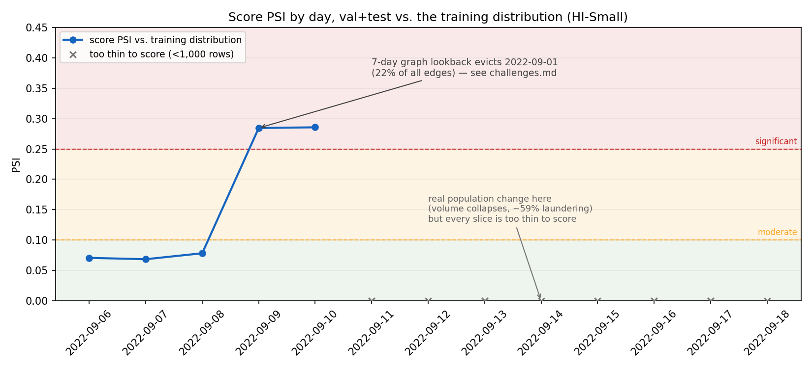

# Results

Numbers here are regenerated by running the scripts in `src/`, not hand-typed — each section
names the command that produces it. See `PLAN.md` for the phase each section belongs to.

## Phase 2 — Rules baseline

Command: `python -m src.rules_baseline`

A deliberately simple rules engine (`src/rules_baseline.py`) mimicking what a bank might
deploy: a large-amount threshold (USD-equivalent > $10,000, the US BSA/CTR reporting
threshold), structuring (3+ transactions in the $9,000-$10,000 band from the same account
within 24h), and rapid pass-through (funds forwarded onward within 2h of arrival).

| Metric | Value |
|---|---|
| Total transactions | 5,078,345 |
| Alerts raised | 1,842,519 |
| Alert rate | 36.3% |
| True positives caught | 3,139 / 5,177 |
| **Precision** | **0.17%** |
| **Recall** | **60.6%** |

Per-rule alert counts (a transaction can trigger more than one rule):

| Rule | Alerts |
|---|---|
| Large amount | 951,263 |
| Structuring | 5,764 |
| Pass-through | 1,197,671 |

**Reading this:** the rules engine already catches a majority of known laundering (60.6%
recall) — the realistic failure mode isn't that rules miss everything, it's that they bury an
analyst under noise to get there. At a 36.3% alert rate, more than one in three transactions
in this dataset would need manual review, at a 0.17% hit rate. This is the baseline every
later model in this project is judged against: **can we hold recall near 60.6% while cutting
the 1,842,519-alert volume down substantially?** That comparison, done properly in Phase 5,
is the project's headline result — not a standalone AUC number.

**Caveats, stated up front:**
- Amounts are converted to USD-equivalent using a static, approximate FX table for the
  dataset's September 2022 window (`config.yaml`'s `fx_rates_to_usd`) — a real deployment
  would use point-in-time FX rates per transaction date.
- The pass-through rule is timing-only (no amount-matching between the inbound and outbound
  leg), which is why it dominates the alert volume — a known, documented simplification, not
  a bug. It's also a fair reflection of why real rule-based pass-through checks are noisy.
- Structuring's low alert count (5,764) is expected: it requires 3+ qualifying transactions
  from the *same account* clustered within 24h, a narrow pattern by design.

## Phase 4 — Modelling (XGBoost + Isolation Forest)

Command: `python -m src.model` (also runnable as `notebooks/03_modelling.ipynb`)

Time-ordered 60/20/20 split (never a random shuffle — see `CLAUDE.md`'s no-leakage
constraint), `scale_pos_weight` computed from the training split only.

| Split | Rows | Positives | Prevalence | Time range |
|---|---|---|---|---|
| Train | 3,047,007 | 2,298 | 0.075% | 2022-09-01 00:00 – 2022-09-06 13:36 |
| Val | 1,015,669 | 1,082 | 0.107% | 2022-09-06 13:36 – 2022-09-08 16:12 |
| Test | 1,015,669 | 1,797 | 0.177% | 2022-09-08 16:12 – 2022-09-18 16:18 |

`scale_pos_weight` (train-only): **1,324.94**

| Metric (test split) | Value |
|---|---|
| PR-AUC | 0.3967 |
| ROC-AUC | 0.9828 |
| Precision@100 | 92.0% |
| Precision@500 | 74.8% |
| Precision@1000 | 60.6% |
| Precision@5000 | 20.7% |

These are sanity-check numbers confirming the model learned real signal, **not** the
project's headline result — the full evaluation suite (recall-per-typology,
false-positive-reduction-vs-the-Phase-2-baseline-at-equal-recall, calibration) is Phase
5's job and will supersede this section.

**Important caveat, investigated not just disclosed:** `payment_format_ACH` dominates
feature importance. 86.6% of all laundering transactions in this dataset use ACH format,
and ACH's laundering rate (0.75%) is ~7.3x the dataset's overall prevalence, while `Wire`
and `Reinvestment` have zero laundering transactions anywhere in the data. Retraining
with every `payment_format_*` column dropped: PR-AUC falls from 0.3967 to **0.0705**,
ROC-AUC from 0.9828 to **0.9160**, precision@100 from 92% to **62%**. So a substantial
share of the headline numbers above is attributable to this one categorical correlation
— which may reflect real laundering behavior (ACH is a genuinely common layering
channel) or may be a synthetic-generator artifact; this project can't fully distinguish
the two from the data alone, and any performance claim should carry that caveat. The
more load-bearing finding for this project's actual thesis: with `payment_format`
removed, the top features are `receiver_in_30d_distinct_counterparties`,
`sender_graph_in_cycle`, and `sender_out_7d_distinct_counterparties` — exactly the
Phase 3 account/window and graph features, still performing far better than random
(62% precision@100 vs. a 0.18% base rate). Full writeup in `reports/challenges.md`.

**Isolation Forest (unsupervised layer):** trained on the same features, no labels.
Top-1000 most-anomalous test transactions overlap **0%** with XGBoost's top-1000, and
catch only 1 of 1,797 actual test-split laundering cases. Investigated, not just
reported: the Isolation Forest's top-1000 sit at the extreme tail of raw volume
features (`sender_out_30d_count` mean of 149,867 vs. an overall mean of 7,890, near the
dataset's actual maximum) — it's rediscovering the highest-throughput hub accounts
(almost certainly legitimate), not laundering-specific behavior. A defensible fix
(log-transforming heavy-tailed features, or fitting on ratio/score features instead of
raw counts) is noted as future work, not implemented in this phase. Full writeup in
`reports/challenges.md`.

## Phase 5 — Evaluation (the headline result)

Command: `python -m src.evaluate` (also runnable as `notebooks/04_evaluation_explainability.ipynb`)

**Methodology note:** every number here is computed on the model's held-out test split
(1,015,669 transactions) — never train/val. The rules baseline used for comparison is
**not** the Phase 2 full-dataset number; it's the same rules engine re-evaluated on
exactly this test population (computed on the full dataset first, so structuring/
pass-through rules keep their rolling-window historical context across the split
boundary, then restricted to the test split's rows) — the correct apples-to-apples
comparison, since the two systems must be judged on the same transactions.

| | Rules baseline (test split) | XGBoost (test split, at matched recall) |
|---|---|---|
| Alerts raised | 297,564 | **10,011** |
| Recall | 68.84% | 68.84% (matched) |

### >>> HEADLINE: at equal recall (68.8%), the model raises 96.6% fewer alerts than the rules baseline. <<<

(Test-split recall for the rules baseline is 68.8%, not the Phase 2 full-dataset
figure of 60.6% — expected, not a discrepancy: the test split's own composition
differs from the full dataset, per Phase 4's split table above, and this is the
correct, population-matched baseline for this specific comparison.)

**Recall per laundering typology**, at the same operating point behind the headline
number:

| Typology | Transactions | Caught | Recall |
|---|---|---|---|
| FAN-IN | 137 | 123 | 89.8% |
| GATHER-SCATTER | 401 | 350 | 87.3% |
| SCATTER-GATHER | 252 | 209 | 83.0% |
| FAN-OUT | 140 | 113 | 80.7% |
| RANDOM | 86 | 67 | 77.9% |
| CYCLE | 109 | 84 | 77.1% |
| STACK | 140 | 107 | 76.4% |
| BIPARTITE | 74 | 50 | 67.6% |

No typology falls dramatically below the others — even patterns without a dedicated
graph feature (`BIPARTITE`, `STACK`, `RANDOM`) are caught at a broadly similar rate to
`FAN-IN`/`CYCLE`, which the Phase 3 graph features specifically target.

**Supporting metrics (test split):** PR-AUC 0.3967, ROC-AUC 0.9828 (reference only —
see Phase 4's discussion of why), precision@100 92.0%, precision@500 74.8%,
precision@1000 60.6%, precision@5000 20.7%.

**Calibration — an important caveat, investigated not just noted:** the model's raw
score is not a calibrated probability. Mean predicted score on the test split is
7.31%, ~41x the actual test prevalence of 0.177%. This is the expected, direct
consequence of `scale_pos_weight=1324.94` (Phase 4) — the same weighting that lets the
model rank rare positives above the enormous negative class inflates scores for
anything resembling a positive, at the cost of the raw output no longer meaning
"probability." This does not undermine any number above: precision@k,
recall-per-typology, and the headline reduction all depend only on the model's
*ranking*, which this distortion doesn't change. It would matter if this project ever
displayed a literal "X% chance of laundering" figure to an analyst — for that, a
post-hoc calibration step (Platt scaling or isotonic regression on the validation
split) is noted as future work, not implemented here.

## Phase 6 — Explainability (SHAP reason codes)

Source: `notebooks/04_evaluation_explainability.ipynb` sections 7.x (the authoritative
run for the numbers below). `python -m src.explain` is a lighter-weight check of the same
code path; it samples the top-5,000 alerts instead of the Phase 5 equal-recall queue
(which would require re-running the rules baseline over the full dataset), so its mean
|SHAP| magnitudes differ slightly from the table below while the ranking is unchanged.

**Explanation sample: 30,571 rows.** All 1,797 test positives (at 0.177% test prevalence
a uniform sample would contain almost none, leaving global importance describing only
legitimate traffic) ∪ the 10,011-alert Phase 5 queue (1,237 of which are positives) +
20,000 seeded background negatives. `TreeExplainer` is exact per row, so this bound is
about runtime/memory, not approximation.

**Faithfulness check.** Derived SHAP base value 0.123039; max
`|base + sum(SHAP) − margin|` = **4.77e-06** across all 30,571 rows — the additivity
identity holds, so the contributions correspond to what the model actually computed. The
base value is derived (`shap_base_value`), never read from
`shap.TreeExplainer.expected_value`; see the Phase 6 entry in `reports/challenges.md` for
why that attribute is unsafe here.

**Global feature importance (mean |SHAP|, top 10).** `mean_shap` is reported alongside to
separate "matters and pushes toward laundering" from "matters and pushes away from it";
it is negative for most features simply because the overwhelming majority of rows are
legitimate — `payment_format_ACH` is the notable exception, positive on average.

| Feature | mean \|SHAP\| | mean SHAP |
|---|---|---|
| payment_format_ACH | 1.8279 | +0.0776 |
| amount_paid_usd | 0.5558 | −0.2396 |
| sender_out_7d_distinct_counterparties | 0.4140 | −0.3043 |
| receiver_in_7d_distinct_counterparties | 0.3714 | −0.0870 |
| sender_out_1d_distinct_counterparties | 0.2261 | −0.1565 |
| sender_out_1d_count | 0.2093 | −0.1609 |
| sender_out_7d_count | 0.1786 | −0.1040 |
| receiver_in_7d_count | 0.1738 | −0.1487 |
| receiver_in_1d_count | 0.1691 | +0.0026 |
| sender_out_7d_amount_usd | 0.1518 | −0.1181 |

Figure: `reports/figures/06_shap_global_importance.png`.

**Per-alert reason codes.** Built from the top positive SHAP contributors rendered against
each row's own raw feature values. Only features that pushed the score *up* are cited — a
negative contribution means the feature argued against the alert, and citing it as a
reason would be misleading in a case note. Example, the top-ranked test alert (score
0.9952, true positive):

- *faithful:* "Flagged: the payment was made via ACH; the receiver received from 11
  distinct counterparties in the past 7 days; a $18,756 payment."
- *behavioural:* "Flagged: the receiver received from 11 distinct counterparties in the
  past 7 days; a $18,756 payment; the receiver received from 10 distinct accounts in the
  graph window."

All five spot-checked alerts (the top-5 by score) are true positives, and every clause was
verified against that row's raw feature values — programmatically, by parsing the number
back out of the generated sentence and comparing it to the modelling table, in
`investigations/phase6_explainability/02_reason_code_spot_check_vs_raw_values.py`.

### The Phase 6 finding: a faithful reason code leads with the same clause 99.86% of the time

Phase 4's `payment_format_ACH` dominance persists under SHAP (mean |SHAP| 1.83 vs. 0.56
for the next feature). Measured over the 10,011-alert Phase 5 queue — the queue an analyst
would actually be handed — `payment_format_ACH` is the single largest positive contributor
on **9,997 of 10,011 alerts (99.86%)**, and only **4** distinct features ever lead the
sentence. An opening clause identical on ~99.9% of the queue carries no triage
information, however faithful it is to the model.

Response: `build_reason_code` accepts `exclude_features`, and a second **behavioural**
variant is produced with the payment-format one-hots excluded from the *sentence only* —
never from the model, so no metric above changes. Leading feature across the same queue:

| Leading feature | Faithful | Behavioural |
|---|---|---|
| payment_format_ACH | 9,997 (99.86%) | — |
| receiver_in_7d_distinct_counterparties | 12 (0.12%) | 4,106 (41.01%) |
| amount_paid_usd | — | 2,786 (27.83%) |
| sender_graph_fan_in_score | — | 1,553 (15.51%) |
| receiver_in_1d_count | — | 1,250 (12.49%) |
| sender_out_7d_count | — | 151 (1.51%) |
| receiver_in_7d_amount_usd | — | 139 (1.39%) |
| other (5 features) | 2 (0.02%) | 26 (0.26%) |
| **distinct leading features** | **4** | **11** |

The behavioural variant surfaces the Phase 3 account/window and graph features —
including `sender_graph_fan_in_score`, the network structure this project exists to
exploit — rather than a payment-method constant.

**A precision worth keeping:** it would overstate the case to call the faithful variant
information-free. Its second and third clauses still vary, so it produces 7,098 distinct
sentences across the 10,011-alert queue (behavioural: 8,844; most-repeated sentence 290
vs. 104). The defensible claim is the narrower one: its *leading* clause, the part read
first, is the same on ~99.9% of alerts.

Both variants are reported rather than picking one, because they answer different
questions — *what is the model actually doing* (faithful) versus *what should an analyst
look at on this case* (behavioural). Reproduced by
`investigations/phase6_explainability/03_ach_dominance_in_reason_codes.py`; full writeups
of all three Phase 6 findings in `reports/challenges.md`.

---

## Phase 7 — Monitoring (PSI/CSI drift)

Produced by `src/monitoring.py` (run as `python -m src.monitoring`), which also writes
`reports/figures/07_score_psi_over_time.png`. Reference distribution throughout is the
**training split**, never a neighbouring time slice: chained adjacent comparisons make
gradual drift invisible, since each day looks like the day before it right up until the
model is scoring a population it has never seen.

Bands are the conventional credit-risk reading (<0.10 stable, 0.10–0.25 moderate, >0.25
significant). They are convention, not theory, and are used because a model-risk reviewer
expects them.

### Score PSI

| Comparison | PSI | Band |
|---|---|---|
| train → val | 0.0682 | stable |
| train → test | 0.2433 | moderate |
| train → test, excluding the 2022-09-11+ tail | 0.2442 | moderate |
| train → the 2022-09-11+ tail alone (1,108 rows) | **10.4044** | significant |

| Day | Rows | PSI | Band |
|---|---|---|---|
| 2022-09-06 | 201,914 | 0.0707 | stable |
| 2022-09-07 | 482,751 | 0.0685 | stable |
| 2022-09-08 | 482,773 | 0.0783 | stable |
| 2022-09-09 | 654,467 | 0.2845 | significant |
| 2022-09-10 | 208,325 | 0.2856 | significant |
| 2022-09-11 → 09-18 | 396 → 11 | — | insufficient_data |

### The three findings, and what is real

The headline Phase 7 result is that **most of what this monitor reports is not drift in
the data**, and the one change that unambiguously is drift is the one the daily monitor
structurally cannot see. All three are written up in `reports/challenges.md`'s Phase 7
section with backing scripts in `investigations/phase7_monitoring/`.

**1. The 09-09 step change is the model's own feature pipeline.** PSI is flat (~0.07) for
three days and then steps ~4x in one day with no ramp. `graph_features.lookback_days` is
7 and the dataset starts 2022-09-01, so 2022-09-09 is the first day the trailing graph
window evicts anything — and what it evicts is 2022-09-01, HI-Small's single largest day
(1,114,921 rows, 22.0% of the dataset). 8 of the top 10 CSI drivers across the step are
`*_graph_*` features. The bottom score decile drains from 4.23% to 1.27% of the day's rows
overnight. Nothing about the transactions changed.

**2. Most feature-level CSI is rolling-window warm-up.** 23 of 54 features land in the
significant band on train → test, led by `receiver_in_30d_count` at CSI 3.08 (mean 8.00 →
25.55). But HI-Small spans ~17–18 days while `windows.rolling_days` includes 7 and 30, so
a 30-day window is longer than the dataset and can only accumulate. The discriminating
check is whether non-windowed features move the same way — they do not:

| Feature group | stable | moderate | significant |
|---|---|---|---|
| windowed (`*_Nd_*`, `*_graph_*`) | 14 | 10 | 22 |
| non-windowed | 7 | 0 | 1 |

`amount_paid_usd`, the only continuous non-windowed feature, is stable at CSI 0.0669
against a windowed maximum of 3.0752.

**3. The one real non-windowed drift, and the one the monitor misses.** The single
non-windowed feature in the significant band is genuine: `payment_format_Reinvestment`
(CSI 1.9169) is 43.15% of transactions on 2022-09-01 and 0.00% on every day after — all
481,056 Reinvestment transactions in HI-Small fall on the dataset's first calendar day.
Separately, from 2022-09-11 onward the data becomes a different population entirely —
daily volume collapses from 654,467 rows to 11, the laundering rate goes from ~0.09% to
59.12%, and payment format becomes 100% ACH. Aggregated, its score PSI is 10.40. Every
individual day of it is below `min_slice_size` and is correctly reported as
`insufficient_data`, so the daily monitor never scores it.

### Robustness: the headline result does not depend on the tail

Because that tail sits inside the test split and holds 36.4% of its positives in 0.109%
of its rows, the Phase 5 headline was re-derived without it, using the same
`evaluate.py` machinery:

| Population | Baseline alerts | Baseline recall | Model alerts | FP reduction |
|---|---|---|---|---|
| Full test split | 297,564 | 68.8% | 10,011 | **96.6%** |
| Body only (< 2022-09-11) | 296,597 | 61.9% | 11,140 | **96.2%** |
| Tail only (≥ 2022-09-11) | 967 | 80.9% | 765 | 20.9% |

The headline survives: removing the tail entirely moves the reduction by 0.4 percentage
points. The tail-only figure is low for a reason that is not a model failure — at ~59%
prevalence there are barely any false positives left to remove, so the rules baseline is
already close to right and there is almost no headroom.

### A defect found and fixed in this module

The first version of `characteristic_stability` quantile-binned every feature and
therefore scored **0.0000** for `payment_format_Reinvestment` in the exact comparison
where that format went from 15.8% of transactions to zero — and 0.0000 for
`payment_format_ACH`, the model's single most important feature (Phase 4). Every quantile
of a 0/1 column is the same value, so the edges collapse to one bin and the metric can no
longer express anything. Features with at most `max_categorical_cardinality` (10) distinct
reference values now route through `category_share_psi` instead, and the table reports
which path each feature took. This moved three previously-invisible binary features into
the significant band (20 → 23) and put `payment_format_Reinvestment` at rank 2.

### Honest limitations

- **The bands are convention.** 0.10/0.25 come from credit-scorecard practice, not from
  anything derived on this data.
- **`min_slice_size` trades a blind spot for noise, and both are real.** Lowering it would
  score the tail but would also score 46-row slices where PSI is sampling noise. The right
  production answer is a **volume monitor** beside the distribution monitor: daily row
  count falling 654,467 → 11 needs no binning to detect.
- **No labels are used anywhere in this phase**, deliberately — at ~0.10% prevalence with
  SAR outcomes arriving weeks-to-months later, distribution monitoring is the only signal
  available before labels exist. It detects that the input moved, never that performance
  degraded.
- **The `epsilon` floor bounds an emptied bin's contribution** rather than letting it go to
  infinity, so an extreme PSI's magnitude is partly a function of that constant. It does
  not change which band a value lands in at any plausible epsilon.

---

## Phase 8 — Demo artifact (what the deployed app will read)

Command: `python -m scripts.build_demo_artifact`

Writes the two files the Streamlit app loads. Nothing in the app recomputes any of this
(CLAUDE.md's deployment model): Streamlit Community Cloud's ~1 CPU / ~1GB RAM cannot hold
the 728MB modelling table, let alone score it or run SHAP over it.

| Artifact | Size | Contents |
|---|---|---|
| `app/data/demo_alerts.parquet` | **15.3 MB** (target <20MB) | 30,000 rows x 126 columns |
| `app/data/demo_metrics.json` | 36 KB | headline, PR curve, per-typology recall, calibration, PSI series, global SHAP importance |

The parquet carries, per row: display fields (timestamp, banks, accounts, amount, currency,
format), `model_score`, `rank`, `in_alert_queue`, `is_laundering`, `pattern_type`,
`is_tail_population`, both reason-code variants, and — prefixed `feat_*` / `shap_*` — all
54 raw feature values with their 54 SHAP contributions, so the app can draw a genuine
waterfall without shap installed.

### The sample, and what it does and doesn't preserve

| Stratum | Rows | Sampled? |
|---|---|---|
| Every test-split positive | 1,797 | no — all kept |
| The equal-recall alert queue | 10,011 | no — ships whole |
| Negatives, stratified across score deciles | 19,429 | yes, seeded |
| **Total** | **30,000** | of 1,015,669 test rows |

**Ranks are true ranks.** Scores, ranks and the alert queue are computed over the complete
1,015,669-row test split *before* sampling, so rank 1 is the highest-scored transaction in
the test split, not the highest-scored survivor of sampling. Verified in CI: the queue is
exactly ranks 1–10,011 with no holes, and score is monotone non-increasing in rank.

**The artifact reproduces every headline number exactly**, recomputed from the pipeline
rather than copied from this file: 10,011 vs. 297,564 alerts at 68.8% matched recall
(**96.6%** reduction), **96.2%** excluding the 2022-09-11+ tail, PR-AUC 0.3967, ROC-AUC
0.9828, precision@100 92%, and the same per-typology recall table as Phase 5.

### The tail is over-represented, on purpose and on the record

Keeping every positive necessarily over-weights the Phase 7 tail, because that tail holds
36.4% of test positives in 0.109% of test rows:

| | Share of rows |
|---|---|
| Tail in the real test split | 0.109% |
| Tail in the demo artifact | **3.097%** (~28x) |

This is not corrected by resampling — doing so would distort the alert queue the headline
describes. Instead every row carries `is_tail_population`, both shares are recorded in the
metrics JSON, and the tail-excluded headline (96.2%) ships alongside the headline, so the
app can filter it and a reviewer can see the effect rather than take it on trust.

### SHAP fidelity of the shipped file

The shipped `shap_*` columns plus the shipped base value (0.123039, derived via
`explain.shap_base_value`, never `TreeExplainer.expected_value`) reconstruct the shipped
`model_score` to a **maximum absolute error of 5.2e-07** (mean 2.9e-08) across all 30,000
rows — float32 storage rounding, nothing else. Asserted in CI, because an explanation that
silently describes a different prediction than the one being ranked is the worst available
failure mode for this layer.

### Reason-code variants in the artifact

Both ship. Divergence between them is **99.87% inside the alert queue** — matching Phase 6's
99.86% ACH-dominance figure on an independently constructed sample — and 33.53% outside it,
for a mechanical reason documented in `challenges.md`: off-queue rows are mostly Cheque/
Credit Card, where the `payment_format_ACH` one-hot contributes *negatively* (mean −1.52 vs.
+2.25 on ACH rows) and is therefore dropped from both variants by positive-only
`top_contributors`. The variants diverge exactly where the model is alerting, which is where
it matters.

### Honest limitations

- **The app shows a sample, the reported numbers come from the full split.** Every metric in
  `demo_metrics.json` is computed on all 1,015,669 test rows; only the browsable table is
  sampled. The app must say so, and the README will.
- **Below-the-queue rows are a stratified sample, so counts in that region are not
  population counts.** Ranks and scores remain true, but "how many alerts scored between X
  and Y" cannot be answered from the artifact alone.
- **15.3 MB is comfortable but not free.** Most of it is the 108 `feat_*`/`shap_*` columns.
  Shipping only the top-N contributors per row would cut it substantially, at the cost of the
  full waterfall — kept for now since the budget holds.

---

## Phase 9 — Streamlit app

Command: `streamlit run app/streamlit_app.py`

The Analyst Alert-Triage Dashboard, in four tabs. It reads only the two Phase 8 artifacts
and computes nothing about the model — no feature engineering, no inference, no SHAP.
`app/requirements.txt` therefore excludes shap/xgboost/scikit-learn entirely.

| Tab | Shows |
|---|---|
| **Alert Queue** | Rank-ordered queue with the behavioural reason code inline; filters for typology, payment format, date, minimum score, account/bank search, queue-only, and the anomalous tail; top-N slider and CSV export. |
| **Alert Detail** | Per-alert SHAP waterfall (top 10 contributions + an aggregated remainder), both reason-code variants, full 54-feature table with values and contributions. |
| **Model Performance** | Headline callout, PR curve against the prevalence baseline, recall-per-typology, score-PSI-over-time with bands, global SHAP importance, precision@k. |
| **About** | Framing, how it works, and the caveats below. |

### Two structural rules the app follows

- **It never re-ranks.** `load_alerts` sorts by the shipped `rank` and every filter is a
  mask over that order. Recomputing a rank over the 30,000 shipped rows would redefine
  "rank 1" from *highest-scored transaction in the held-out split* to *highest-scored row
  that survived sampling*. Asserted in `tests/test_app_artifact.py`.
- **It labels sample counts as sample counts.** Only the 10,011-alert queue and the 1,797
  positives ship complete, so any view reaching below the cut-off gets an explicit warning
  that counts there are not population counts (`queue_stats(...)["population_exact"]`).

### Verification

PLAN.md's Phase 9 check ("click through all four tabs, no exceptions") is executed rather
than remembered: `tests/test_app_smoke.py` runs the real script headless through
`streamlit.testing.v1.AppTest` and asserts on the rendered elements. **24 tests** cover the
app (16 on the data layer, 8 end-to-end); the suite is **147 total**, up from 123.

Two defects were found this way and fixed — both would have reached the deployed URL:

| Defect | Effect |
|---|---|
| `st.slider` raises when `min_value == max_value` | Any filter narrowing the view to ≤10 rows crashed the queue tab |
| `from app import artifact` | `streamlit run` puts `app/` on `sys.path`, not the repo root — `ModuleNotFoundError` on Streamlit Cloud, invisible under pytest |

Both are written up in `challenges.md`.

### Honest limitations

- **The waterfall labels features, it does not interpret them.** `prettify_feature` is
  cosmetic only; the interpretation lives in the precomputed reason codes. A second copy
  of the explanation logic in a module that cannot import `src.explain` is a second copy
  that can drift out of agreement with the first.
- **The `AppTest` harness is not a browser.** It exercises the script and its widget
  state, not rendering, CSS or the plotly charts themselves.
- **Filter semantics distinguish "untouched" from "emptied".** An untouched multiselect
  means no constraint; an emptied one means show nothing. Tested, because collapsing the
  two would make clearing a filter look like a no-op.
